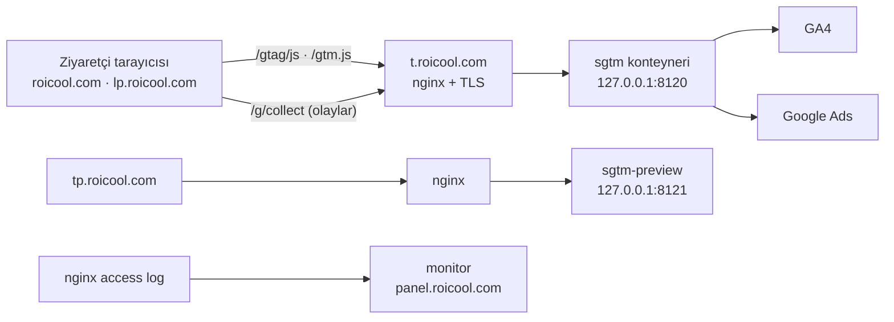

# Roicool — Server-side Google Tag Manager (sGTM) Kurulumu

Tarih: 29 Eylül 2026 · Kapsam: roicool.com + lp.roicool.com · Durum: canlıda

Bu doküman Roicool'un sGTM kurulumunu uçtan uca anlatır: ne olduğu, neden kurulduğu, mimari,
her adresin görevi, sunucu ve GTM tarafındaki ayarlar, site entegrasyonu, izleme paneli, doğrulama,
sorun giderme ve bakım. Kod ve altyapı dosyaları `Roicool/lp-roicool` reposundadır.

---

## İçindekiler

1. [Özet](#1-özet)
2. [Neden kurduk](#2-neden-kurduk)
3. [Mimari](#3-mimari)
4. [Adresler ve kimlikler](#4-adresler-ve-kimlikler)
5. [Sunucu tarafı](#5-sunucu-tarafı)
6. [GTM server container içeriği](#6-gtm-server-container-içeriği)
7. [Site entegrasyonu](#7-site-entegrasyonu)
8. [İzleme: CMS durum paneli ve panel.roicool.com](#8-izleme)
9. [Doğrulama: çalıştığını nasıl görürüm](#9-doğrulama)
10. [Sorun giderme](#10-sorun-giderme)
11. [Bakım ve operasyon](#11-bakım-ve-operasyon)
12. [Neden Stape değil](#12-neden-stape-değil)
13. [Kurulum geçmişi](#13-kurulum-geçmişi)
14. [Dosya haritası](#14-dosya-haritası)

---

## 1. Özet

sGTM, Google Ads ve GA4 ölçümünü ziyaretçinin tarayıcısından doğrudan Google'a göndermek yerine,
önce bizim alan adımızdaki bir sunucuya (`t.roicool.com`) gönderen kurulumdur. O sunucu veriyi
alır, işler ve Google'a kendisi iletir.

- Google'ın **resmi** tagging sunucusu imajı (`gtm-cloud-image`) kendi sunucumuzda Docker ile çalışır.
- Stape gibi bir aracı hizmet yoktur; aylık ek maliyet yoktur.
- roicool.com ve tüm lp.roicool.com sayfaları **aynı** sGTM'i kullanır.
- Tarayıcı `googletagmanager.com` ya da `google-analytics.com` ile hiç konuşmaz; hem script hem
  ölçüm `.roicool.com` alanında kalır.

---

## 2. Neden kurduk

Asıl kazanç **veri kaybının azalmasıdır**. Google Ads'in teklif algoritması gördüğü dönüşüm kadar
öğrenir; ölçülemeyen her dönüşüm bütçenin yanlış yere gitmesi demektir.

| Fayda                          | Mekanizma                                                                                      | İşe etkisi                                                                                      |
| ------------------------------ | ---------------------------------------------------------------------------------------------- | ----------------------------------------------------------------------------------------------- |
| Ad-blocker dayanıklılığı       | Script ve ölçüm `t.roicool.com`'dan gider; engelleyici listeleri Google alan adlarını hedefler | Engelleyici kullanan ziyaretçilerin dönüşümleri de sayılır                                      |
| Uzun ömürlü first-party çerez  | Conversion Linker çerezi `.roicool.com` alanında **sunucu** tarafından yazılır                 | Safari ITP'nin JS çerezlerine koyduğu 7 günlük sınıra takılmaz; geç dönüşen ziyaretçi kaybolmaz |
| Daha az client JS              | Sayfada tek `gtag.js`; ileride eklenecek pikseller sunucuda çalışır                            | Daha hızlı sayfa, daha iyi Core Web Vitals, Ads kalite puanına katkı                            |
| Veri kontrolü                  | Google'a giden her istek bizim sunucudan geçer                                                 | Alan silme, IP anonimleştirme, KVKK açısından tek noktadan yönetim                              |
| Enhanced Conversions hazırlığı | Hash'li e-posta/telefon sunucudan Ads'e gönderilebilir                                         | CRM'de nitelikli olan lead Google'a geri bildirilir                                             |
| Tek nokta                      | Tüm siteler aynı konteyneri kullanır                                                           | Yeni bir pixel (Meta CAPI vb.) bir kez eklenir, her yerde geçerli olur                          |

Sektörde ad-blocker ve ITP kaynaklı kaybın %10–30 aralığında olduğu kabul edilir (yaklaşık; siteye
göre değişir). Kesin etki, kurulum öncesi/sonrası Ads dönüşüm sayısı karşılaştırılarak ölçülür.

---

## 3. Mimari



**Akış**

1. Sayfa `https://t.roicool.com/gtag/js?id=AW-…` adresinden `gtag.js`'i yükler.
2. Her `gtag('config', …)` çağrısında `server_container_url: 'https://t.roicool.com'` verilir.
3. Tarayıcı olayları (sayfa görüntüleme, huni olayları, dönüşüm) `t.roicool.com/g/collect`'e gönderir.
4. sGTM'deki **GA4 client** isteği yakalar, olaya çevirir; tag'ler GA4'e ve Google Ads'e iletir.
5. **Conversion Linker** tag'i `_gcl_*` çerezini sunucu tarafında `.roicool.com` alanına yazar.

**Ağ kuralları**

- Konteynerler yalnız `127.0.0.1`'e bağlanır; internete açılım host üzerindeki nginx ile olur.
- DNS Cloudflare'dedir; kayıtlar proxy'li (turuncu bulut) olabilir.
- nginx, Cloudflare arkasındaki gerçek ziyaretçi IP'sini `cloudflare-realip.conf` ile alır.

---

## 4. Adresler ve kimlikler

### Adresler

| Adres                                               | Görev                                         | Arkasındaki servis | Yerel port |
| --------------------------------------------------- | --------------------------------------------- | ------------------ | ---------- |
| `https://t.roicool.com`                             | Tagging: script sunumu ve `/g/collect` ölçümü | `sgtm`             | 8120       |
| `https://tp.roicool.com`                            | GTM Önizleme / debug akışı                    | `sgtm-preview`     | 8121       |
| `https://panel.roicool.com`                         | sGTM izleme paneli (şifreli)                  | `monitor`          | 4200       |
| `https://lp.roicool.com/admin` → Ayarlar → Tracking | sGTM ayarları + canlı durum paneli            | `cms`              | 3020       |

Sunucu: Hetzner, Ubuntu 24.04, `46.225.185.148`. Uygulama dizini `/opt/lp-roicool`.

### Kimlikler

| Kimlik           | Ne                             | Nerede kullanılır                                                   |
| ---------------- | ------------------------------ | ------------------------------------------------------------------- |
| `AW-17287475589` | Google Ads                     | Sayfa snippet'i, sGTM Web Kapsayıcısı izin listesi, Ads tag'leri    |
| `G-3SE1MB5EMG`   | GA4 ölçüm kimliği              | Sayfa snippet'i, sGTM izin listesi, GA4 tag'i                       |
| `GTM-K5D24HJS`   | roicool.com web GTM konteyneri | roicool.com'da `t.roicool.com/gtm.js` üzerinden first-party sunulur |

### Kullanılan yollar

| Yol                | Ne döner            | Client            |
| ------------------ | ------------------- | ----------------- |
| `/gtag/js?id=…`    | gtag.js kütüphanesi | Web Kapsayıcısı   |
| `/gtm.js?id=GTM-…` | Web GTM konteyneri  | Web Kapsayıcısı   |
| `/g/collect`       | 204 (ölçüm alındı)  | GA4               |
| `/healthy`         | `ok`                | Sunucunun kendisi |

---

## 5. Sunucu tarafı

### 5.1 Docker Compose servisleri (`infra/docker-compose.yml`)

| Servis         | İmaj                                                   | Profil  | Bellek sınırı | Görev                                                     |
| -------------- | ------------------------------------------------------ | ------- | ------------- | --------------------------------------------------------- |
| `sgtm`         | `gcr.io/cloud-tagging-10302018/gtm-cloud-image:stable` | `sgtm`  | 384 MB        | Tagging sunucusu; `/healthy` sağlık kontrolü 30 sn'de bir |
| `sgtm-preview` | aynı imaj, `RUN_AS_PREVIEW_SERVER=true`                | `sgtm`  | 256 MB        | GTM Önizleme sunucusu                                     |
| `monitor`      | `apps/monitor` (Node 22)                               | `panel` | 128 MB        | Log özeti + izleme paneli                                 |

Ortam değişkenleri:

```yaml
sgtm:
  CONTAINER_CONFIG: ${GTM_CONTAINER_CONFIG} # GTM'den alınan base64 konteyner yapılandırması
  PREVIEW_SERVER_URL: https://tp.roicool.com
  PORT: 8080
sgtm-preview:
  CONTAINER_CONFIG: ${GTM_CONTAINER_CONFIG}
  RUN_AS_PREVIEW_SERVER: "true"
```

Profiller deploy sırasında `.env` içeriğine göre açılır (`.github/workflows/deploy.yml`):

- `GTM_CONTAINER_CONFIG` doluysa → `sgtm` profili (iki sGTM konteyneri)
- `PANEL_PASSWORD` doluysa → `panel` profili (izleme paneli)

### 5.2 `.env` değişkenleri (`/opt/lp-roicool/.env`)

| Değişken               | Değer / açıklama                                                 |
| ---------------------- | ---------------------------------------------------------------- |
| `GTM_CONTAINER_CONFIG` | GTM → server container → Manually provision → "Container Config" |
| `SGTM_PREVIEW_HOST`    | `tp.roicool.com`                                                 |
| `SGTM_PORT`            | `8120`                                                           |
| `SGTM_PREVIEW_PORT`    | `8121`                                                           |
| `PANEL_PASSWORD`       | panel.roicool.com giriş şifresi (sunucuda, repoda değil)         |
| `PANEL_PORT`           | `4200`                                                           |

### 5.3 nginx

`infra/nginx/t.roicool.com.conf` sunucuda `/etc/nginx/sites-available/` altına kopyalanır.

- 80 → 443 yönlendirmesi, `t` ve `tp` için.
- `t.roicool.com` → `127.0.0.1:8120`, keepalive 32, okuma zaman aşımı 30 sn.
  Erişim kaydı: `/var/log/nginx/sgtm.access.log` (izleme paneli bunu okur).
- `tp.roicool.com` → `127.0.0.1:8121`, okuma zaman aşımı 120 sn (debug akışı uzun bağlantı tutar).
- TLS: Let's Encrypt, certbot otomatik yeniler. `t` ve `tp` aynı sertifikayı paylaşır.

`infra/nginx/panel.roicool.com.conf` aynı kalıpta, `127.0.0.1:4200`'e yönlenir ve
`X-Robots-Tag: noindex` ekler.

### 5.4 DNS ve Cloudflare

| Kayıt               | Tip | Hedef            |
| ------------------- | --- | ---------------- |
| `t.roicool.com`     | A   | `46.225.185.148` |
| `tp.roicool.com`    | A   | `46.225.185.148` |
| `panel.roicool.com` | A   | `46.225.185.148` |

Cloudflare → Security → WAF → Custom rules'a **Skip** kuralı (Bot Fight Mode dahil):

```
(http.host in {"t.roicool.com" "tp.roicool.com"})
```

Aksi halde Cloudflare'in bot korumaları Google'ın kendi isteklerine ve Lighthouse'a challenge
gösterip ölçümü bozabilir.

### 5.5 İlk kurulum komutları (bir kez yapıldı)

```bash
# Konteyner yapılandırmasını .env'e yaz
sed -i 's|^GTM_CONTAINER_CONFIG=.*|GTM_CONTAINER_CONFIG=<CONFIG>|' /opt/lp-roicool/.env

# Konteynerleri kaldır
cd /opt/lp-roicool/infra && COMPOSE_PROFILES=sgtm docker compose --env-file ../.env up -d
curl -s http://127.0.0.1:8120/healthy     # ok

# nginx + sertifika
cp /opt/lp-roicool/infra/nginx/t.roicool.com.conf /etc/nginx/sites-available/
ln -sf /etc/nginx/sites-available/t.roicool.com.conf /etc/nginx/sites-enabled/
nginx -t && systemctl reload nginx
certbot --nginx -d t.roicool.com -d tp.roicool.com --non-interactive --agree-tos --redirect -m mahmud.filoglu@roicool.com
nginx -t && systemctl reload nginx
curl -s https://t.roicool.com/healthy      # ok
```

Bundan sonra `main`'e her push GitHub Actions ile sunucuya gider ve sGTM konteynerlerini de günceller.

---

## 6. GTM server container içeriği

### 6.1 Konteyner oluşturma

tagmanager.google.com → Create container → Target platform: **Server** →
**Manually provision tagging server** → gösterilen **Container Config** kopyalanıp `.env`'e yazılır.

### 6.2 Clients (gelen istekleri tanıyan parçalar)

| Client                                                                | Dinlediği yol         | Görev                                  | Kaynak           |
| --------------------------------------------------------------------- | --------------------- | -------------------------------------- | ---------------- |
| **Google Etiket Yöneticisi: Web Kapsayıcısı** (adı: `Google Scripts`) | `/gtag/js`, `/gtm.js` | Google script'lerini first-party sunar | **Elle eklendi** |
| **GA4**                                                               | `/g/collect`          | Ölçüm isteklerini alır, olaya çevirir  | Varsayılan       |

Web Kapsayıcısı ayarları:

- Öncelik `0` (GA4 client ile yolları çakışmaz).
- İzin verilen kapsayıcı kimlikleri: `AW-17287475589`, `G-3SE1MB5EMG`, `GTM-K5D24HJS`.
- Bölgeye özgü ayarlar: ya bir bölge seçilir ya kapatılır; açık ve boş bırakılmaz.

> **Önemli:** sGTM 3.2.0'dan (Eylül 2025) beri `gtag.js`'i GA4 client değil **Web Kapsayıcısı**
> client'ı sunar. Eski rehberlerdeki "GA4 client → Default gtag.js paths" ayarı artık yoktur.
> Bu client eklenmezse `t.roicool.com/gtag/js` çalışmaz ve sayfada ölçüm hiç başlamaz.

### 6.3 Etiket sunma yolu (rastgele önek) — varsayılanı bozma

GTM, Web Kapsayıcısı eklenirken her kimlik için rastgele bir önek gösterir (ör. `/bIM5cphGz0s`).
Bu **isteğe bağlı** ek bir ad-blocker katmanıdır. Önek ancak konteyner **yayınlandıktan sonra**
canlıya çıkar; yayınlanmadan sayfaya yazılırsa her istek **HTTP 400** döner ve ölçüm durur.

Bu yüzden bizde önek **kullanılmıyor**; script varsayılan `/gtag/js` yolundan geliyor ve
lp.roicool.com'daki "sGTM script yolu" alanı boş. Kullanmak istenirse sıra:
GTM'de Yayınla → aşağıdaki komutla 200 doğrula → ancak sonra ayara yaz.

```bash
curl -sI "https://t.roicool.com/gtag/js?id=AW-17287475589"              | head -3   # varsayılan
curl -sI "https://t.roicool.com/bIM5cphGz0s/gtag/js?id=AW-17287475589"  | head -3   # önekli
```

Önek yeniden üretilirse (satırdaki ⟳) eski adres anında ölür.

### 6.4 Tags

| Tag                            | Tetikleyici               | Not                                                            |
| ------------------------------ | ------------------------- | -------------------------------------------------------------- |
| Google Analytics: GA4          | Client Name = GA4         | Measurement ID `G-3SE1MB5EMG`                                  |
| Google Ads Conversion Tracking | Event Name = `conversion` | Conversion ID/Label boş; client'tan gelen `send_to` kullanılır |
| Google Ads Remarketing         | All pages                 | Conversion ID `AW-17287475589`                                 |
| Conversion Linker              | All pages                 | Çerez alanı `.roicool.com`                                     |

### 6.5 Önizleme

GTM → server container → **Preview**. Akış `tp.roicool.com` üzerinden açılır; sitede gezerken
her `/g/collect` isteği, onu yakalayan client ve ateşlenen tag'ler satır satır görünür.

---

## 7. Site entegrasyonu

### 7.1 lp.roicool.com (bu proje)

Admin → **Ayarlar → Tracking**:

| Alan                                | Değer                   | Neden                                                                              |
| ----------------------------------- | ----------------------- | ---------------------------------------------------------------------------------- |
| Google Ads kimliği                  | `AW-17287475589`        |                                                                                    |
| GA4 ölçüm kimliği                   | `G-3SE1MB5EMG`          |                                                                                    |
| Server-side GTM URL                 | `https://t.roicool.com` | **Yolsuz**; `server_container_url` olarak kullanılır, ölçüm `/g/collect`'e gitmeli |
| gtag.js dosyasını da sGTM'den yükle | **Açık**                | Script de first-party gelir                                                        |
| sGTM script yolu                    | **Boş**                 | Varsayılan `/gtag/js` kullanılır (bkz. §6.3)                                       |

Kaydedince build tetiklenir. Sayfalara basılan kod (`apps/site/src/components/Analytics.tsx`):

```html
<script async src="https://t.roicool.com/gtag/js?id=AW-17287475589"></script>
<script>
  window.dataLayer = window.dataLayer || [];
  function gtag() {
    dataLayer.push(arguments);
  }
  gtag("js", new Date());
  gtag("config", "AW-17287475589", {
    server_container_url: "https://t.roicool.com",
  });
  gtag("config", "G-3SE1MB5EMG", {
    server_container_url: "https://t.roicool.com",
  });
</script>
```

Script adresi ile `server_container_url` bilerek ayrı tutulur: önek kullanılırsa yalnız script
adresi değişir, `server_container_url` her zaman öneksiz kalır; aksi halde ölçüm istekleri sahipsiz kalır.

**GA4'e giden huni olayları** (`apps/site/src/scripts/lp.ts`):

| Olay               | Ne zaman                                                   |
| ------------------ | ---------------------------------------------------------- |
| `page_view`        | `gtag config` ile otomatik                                 |
| `lp_scroll`        | %25 / 50 / 75 / 100 kaydırma                               |
| `lp_cta_click`     | CTA düğmesi tıklaması                                      |
| `lp_contact_click` | `tel:`, `wa.me`, `mailto:` tıklaması                       |
| `lp_form_start`    | Forma ilk odaklanma                                        |
| `lp_form_submit`   | Başarılı gönderim                                          |
| `lp_form_error`    | Doğrulama/sunucu hatası                                    |
| `conversion`       | Form başarısında, `send_to` = formdaki Ads dönüşüm etiketi |

Olay parametreleri: `lp_id`, `lp_locale`, `lp_variant`, `lp_campaign`.

### 7.2 roicool.com (ana site, Webflow)

roicool.com web GTM (`GTM-K5D24HJS`) kullanıyor ve konteyner script'i first-party yoldan geliyor:
snippet'teki `www.googletagmanager.com/gtm.js` adresi `t.roicool.com/gtm.js` ile değiştirildi.
Web GTM içindeki GA4 ve Ads tag'lerinde **server_container_url / Transport URL** alanı
`https://t.roicool.com`.

Doğrudan gtag kullanan bir site için eşdeğer snippet §7.1'deki koddur.

---

## 8. İzleme

İki katman var: CMS içindeki anlık durum paneli ve ayrı izleme paneli.

### 8.1 CMS durum paneli (lp.roicool.com/admin → Ayarlar → Tracking)

`GET /api/sgtm-status` (`apps/cms/src/endpoints/dashboard.ts`) dört şeyi ayrı ayrı kontrol eder,
çünkü biri çalışırken diğeri bozuk olabilir:

| Satır         | Kontrol                                              | Kırmızıysa                                                  |
| ------------- | ---------------------------------------------------- | ----------------------------------------------------------- |
| Ayarlar       | Kimlikler ve sGTM adresi girilmiş mi                 | Ayarlar eksik                                               |
| Konteyner     | `t.roicool.com/healthy` → `ok`                       | sGTM ayakta değil                                           |
| Script sunumu | Ayarlardaki adres gerçekten JavaScript döndürüyor mu | 400: yayınlanmamış yol / izinli olmayan ID; 404: client yok |
| Trafik        | Son 24 saatte sitenin kendi beacon'ları geliyor mu   | Site ölçüm göndermiyor                                      |

### 8.2 panel.roicool.com (`apps/monitor`)

Tek süreçli küçük Node servisi, şifreyle korunur (`PANEL_PASSWORD`, 7 günlük imzalı çerez).

**Nasıl çalışır**

- Dakikada bir nginx'in `sgtm.access.log` dosyasını son okunan yerden okur (log rotasyonunu
  inode/boyuttan anlar). Konteynere `/var/log/nginx` salt okunur bağlanır; host'un `adm` grubu verilir.
- Satırları Postgres'te `monitor` şemasına **saatlik özet** olarak yazar: yol grubu × durum kodu × adet.
- `sgtm:8080/healthy`'yi sorar; saatte bir `t.roicool.com` sertifikasının bitişine bakar.
- Saklama: istatistik 35 gün, sağlık 8 gün, son istekler 200 satır.

**Gizlilik:** IP, referer ve sorgu parametreleri atılır; user-agent yalnız tarayıcı ailesine
(Chrome, Safari, Bot/araç…) indirgenir. Ham log sunucudan çıkmaz.

**Ekranlar**

| Bölüm          | İçerik                                                                                                                                  |
| -------------- | --------------------------------------------------------------------------------------------------------------------------------------- |
| Kartlar        | Script sunumu (24 s), ölçüm olayı (24 s), hata oranı (yalnız Google yolları), sGTM sağlığı + 7 gün uptime, sertifika bitişine kalan gün |
| Uyarılar       | Log okunamıyor, sağlık başarısız, Google yollarında 400/404 (teşhis metniyle)                                                           |
| Saatlik tablo  | Son 24 saat: script, ölçüm, diğer, hata                                                                                                 |
| Hatalar        | Durum kodu × yol grubu                                                                                                                  |
| Sağlık geçmişi | Son 7 gün, gün bazında                                                                                                                  |
| Son 50 istek   | Zaman, yöntem, yol, durum, tarayıcı ailesi                                                                                              |

**Yol grupları:** `gtag` (`…/gtag/js`, önekli dahil), `gtm`, `collect`, `healthy`, `other`
(bot taramaları: `/`, `/wp-json/…`), `invalid` (yol olmayan istek satırı: boş ya da TLS baytları).
Hata oranı ve uyarılar yalnız `gtag`/`gtm`/`collect` üzerinden hesaplanır.

> 23 Eylül'de panelde görülen 91 × HTTP 400 incelendi: tamamı WordPress açığı tarayan botlardı
> (`/wp-json/batch/v1`, `/?rest_route=…`, `GET /`). sGTM tanımadığı yola 400 döner; ölçümle ilgisi
> yoktur. Bu yüzden hata oranı Google yollarıyla sınırlandı (#9, #10).

---

## 9. Doğrulama

**Komut satırı**

```bash
curl -s https://t.roicool.com/healthy                                            # ok
curl -sI "https://t.roicool.com/gtag/js?id=AW-17287475589" | head -3             # 200, text/javascript
curl -sI "https://t.roicool.com/gtm.js?id=GTM-K5D24HJS"    | head -3             # 200
```

**Tarayıcı (30 saniye)**

F12 → Ağ → filtre `collect`. Beklenen: istekler `t.roicool.com/g/collect`'e, yanıt **204**.
`google-analytics.com` ya da `googletagmanager.com` isteği **görünmemeli**.

**GA4**

- Admin → **DebugView**: sayfayı `?gtm_debug=x` ile aç ya da "Google Analytics Debugger" eklentisini
  kullan; olaylar canlı akar.
- **Realtime**: olaylar görünüyor ve tarayıcıda Google alan adına istek yoksa akış tamamen server-side.
- GA4 raporlarında "server-side" diye ayrı bir sütun yoktur; olay nereden gelirse gelsin aynı
  görünür. Dolaylı gösterge: kurulumdan sonraki günlerde kullanıcı sayısının artması
  (ad-blocker kullanıcıları sayılmaya başlar) ve Safari'de 7 günden uzun oturumların görünmesi.

**Google Ads**

Hedefler → Dönüşümler → ilgili dönüşüm → **Tanılama**: etiket durumunda sunucu tarafı etiketleme
kullanıldığı görünür. Chrome → Uygulama → Çerezler'de `_gcl_*` çerezi `.roicool.com` alanında,
sunucu tarafından yazılmış olarak (HttpOnly) görünür.

**GTM Preview**

Server container → Önizle → `tp.roicool.com`. Her isteği yakalayan client ve ateşlenen tag'ler
görünür. Toplantıda göstermek için en anlaşılır ekran budur.

**Panel**

panel.roicool.com'da "Ölçüm olayı (24 s)" 0'dan büyükse olaylar sunucudan geçiyor demektir.

---

## 10. Sorun giderme

| Belirti                                     | Olası neden                                                         | Çözüm                                                                             |
| ------------------------------------------- | ------------------------------------------------------------------- | --------------------------------------------------------------------------------- |
| `/gtag/js` **400**                          | Ayarlarda yayınlanmamış bir "sGTM script yolu" girili               | Alanı boşalt, kaydet (build tetiklenir)                                           |
| Düz `/gtag/js` de **400**                   | Web Kapsayıcısı client'ı yayınlanmamış ya da ID izin listesinde yok | GTM → Clients → Web Kapsayıcısı; ID'yi ekle, Yayınla                              |
| `/gtag/js` **404**                          | İsteği hiçbir client karşılamadı                                    | Web Kapsayıcısı client'ı eklenmiş mi, adres doğru mu                              |
| `/healthy` yanıt vermiyor                   | Konteyner düşmüş                                                    | `docker compose --env-file ../.env ps`, `logs --tail=100 sgtm`; `up -d`           |
| Tarayıcıda `google-analytics.com` istekleri | `server_container_url` basılmamış                                   | lp: Ayarlar'daki sGTM URL dolu mu; roicool.com: web GTM tag'lerinde Transport URL |
| Ölçüm var, dönüşüm yok                      | Ads Conversion tag'i tetiklenmiyor                                  | GTM Preview'da `conversion` olayını izle; formda dönüşüm etiketi girili mi        |
| Panelde "Log okunamıyor"                    | Konteyner log dosyasını okuyamıyor                                  | `getent group adm`; gid 4 değilse compose'daki `group_add` güncellenir            |
| Panelde yüksek "bot/tarama" sayısı          | WordPress/genel açık taramaları                                     | Ölçümü etkilemez; istenirse nginx'te Google dışı yollar `return 444` ile kesilir  |
| Cloudflare challenge                        | Bot Fight Mode Google/Lighthouse'u durduruyor                       | §5.4'teki Skip kuralı                                                             |

Log'dan hızlı teşhis:

```bash
# 400'lerin yollara dağılımı
awk '$9==400 {split($7,p,"?"); print p[1]}' /var/log/nginx/sgtm.access.log | sort | uniq -c | sort -rn | head
# 400 alan script isteklerinin kimlikleri
grep ' 400 ' /var/log/nginx/sgtm.access.log | grep -o 'gtag/js?id=[A-Z0-9-]*' | sort | uniq -c
```

---

## 11. Bakım ve operasyon

| İş                     | Nasıl                                                                                   | Sıklık            |
| ---------------------- | --------------------------------------------------------------------------------------- | ----------------- |
| sGTM imaj güncellemesi | `stable` etiketi; `main`'e her push `docker compose build --pull` ile çeker             | Her deploy        |
| Sertifika yenileme     | certbot zamanlanmış görevi; panel bitişe kalan günü gösterir (<21 gün sarı, <7 kırmızı) | Otomatik          |
| Sağlık izleme          | Docker healthcheck (30 sn) + panel (60 sn)                                              | Sürekli           |
| Cloudflare IP listesi  | `infra/nginx/cloudflare-realip.conf`                                                    | Yılda bir kontrol |
| GTM değişikliği        | GTM'de düzenle → Preview ile doğrula → Yayınla                                          | İhtiyaçta         |

**Kaynak kullanımı**

| Konteyner      | Sınır  |
| -------------- | ------ |
| `sgtm`         | 384 MB |
| `sgtm-preview` | 256 MB |
| `monitor`      | 128 MB |

Sunucuda bellek sıkışırsa önizleme sunucusu yalnız debug sırasında çalıştırılabilir:

```bash
cd /opt/lp-roicool/infra && docker compose --env-file ../.env stop sgtm-preview
```

**Consent Mode:** şu an kapalı (`consentMode: false`). Açıldığında sayfa `gtag('consent', …)`
gönderir, sGTM bunu ek ayar gerektirmeden iletir.

---

## 12. Neden Stape değil

Stape, Google'ın aynı sGTM imajını sizin adınıza barındıran bir hizmettir. Yazılım aynıdır;
fark barındırma ve ücrettir.

| Konu          | Kendi sunucumuz                        | Stape                             |
| ------------- | -------------------------------------- | --------------------------------- |
| Yazılım       | Google'ın resmi imajı                  | Google'ın resmi imajı             |
| Aylık maliyet | 0 (mevcut sunucu, ~770 MB RAM toplam)  | Plana ve trafiğe göre aylık ücret |
| Veri nerede   | Bizim sunucu, bizim log                | Stape bulutu                      |
| Kurulum       | 1–2 saat altyapı + GTM                 | Dakikalar                         |
| Güncelleme    | Deploy ile otomatik                    | Yönetilen                         |
| İzleme        | panel.roicool.com (kendi panelimiz)    | Stape paneli                      |
| Ölçek         | Tek makine; gerekirse ikinci konteyner | Otomatik                          |

Gerekirse Stape'e geçiş tek satırdır: sayfadaki `server_container_url` değişir, GTM konteyneri aynı kalır.

---

## 13. Kurulum geçmişi

| Tarih         | Olay                                                                                                   |
| ------------- | ------------------------------------------------------------------------------------------------------ |
| 2026-09-11    | Mimari kararı: sGTM Faz 3'te, Stape olmadan, Google'ın imajıyla                                        |
| 2026-09-12    | sGTM + önizleme konteynerleri, nginx, TLS, DNS; `server_container_url` ile first-party ölçüm           |
| 2026-09-12    | sGTM 3.2.0 değişikliği fark edildi: gtag.js Web Kapsayıcısı client'ından sunuluyor; client eklendi     |
| 2026-09-12    | Admin'e sGTM durum paneli (config / konteyner / script / trafik)                                       |
| 2026-09-12–13 | "sGTM script yolu" ayrı ve varsayılan boş alan yapıldı; yayınlanmamış önek 400'e yol açıyordu (#1, #2) |
| 2026-09-21    | panel.roicool.com izleme paneli yayında (#8)                                                           |
| 2026-09-23    | Panelde bot trafiği hata oranından ayrıldı; 400'lerin ölçüm hatası olmadığı doğrulandı (#9, #10)       |

---

## 14. Dosya haritası

| Dosya                                    | İçerik                                       |
| ---------------------------------------- | -------------------------------------------- |
| `docs/sgtm-setup.md`                     | Adım adım teknik kurulum rehberi             |
| `infra/docker-compose.yml`               | `sgtm`, `sgtm-preview`, `monitor` servisleri |
| `infra/nginx/t.roicool.com.conf`         | Tagging ve önizleme vhost'ları               |
| `infra/nginx/panel.roicool.com.conf`     | İzleme paneli vhost'u                        |
| `infra/nginx/cloudflare-realip.conf`     | Cloudflare arkasında gerçek IP               |
| `.github/workflows/deploy.yml`           | Profillerin `.env`'e göre açılması, deploy   |
| `.env.example`                           | sGTM ve panel değişkenleri                   |
| `apps/cms/src/globals/Settings.ts`       | Tracking ayar alanları                       |
| `apps/cms/src/endpoints/dashboard.ts`    | `GET /api/sgtm-status`                       |
| `apps/cms/src/components/SgtmStatus.tsx` | Admin'deki durum paneli                      |
| `apps/site/src/components/Analytics.tsx` | Sayfaya basılan gtag kodu                    |
| `apps/site/src/scripts/lp.ts`            | Huni olayları ve dönüşüm                     |
| `apps/monitor/`                          | panel.roicool.com (toplayıcı + web)          |
